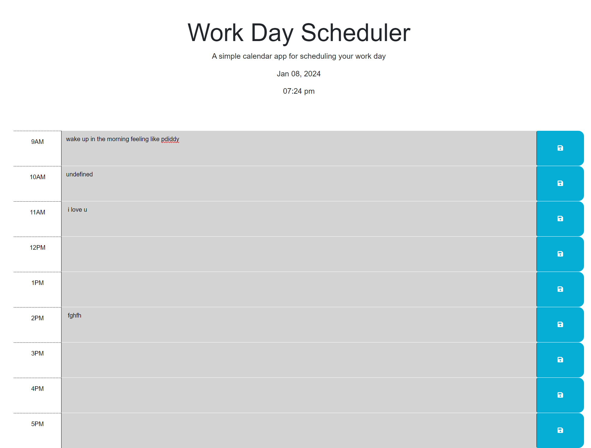

# Hye-Ji Shin's Work Day Scheduler

## User Story

AS AN employee with a busy schedule
I WANT to add important events to a daily planner
SO THAT I can manage my time effectively

## Description

In this repository, you will find the source code for the Work Day Scheduler. It contains a fully functional to-do boxes and save buttons, the curent date and time, as well as color coded boxes telling you when time has past, what time it currently is, and future to-do's. 

The starter code was provided by UT Austin Bootcamp. 

## Technologies Used

HTML
CSS
JavaScript

## Screenshots

Demo:

Current:

## Contact

[GitHub](https://github.com/shinhye-ji)

## Live Link

[Live](https://shinhye-ji.github.io/work-day-scheduler/)